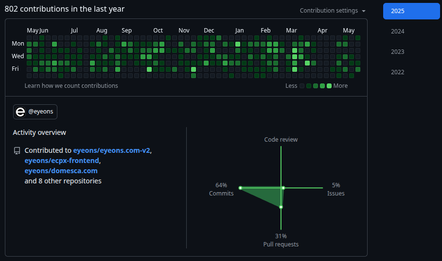
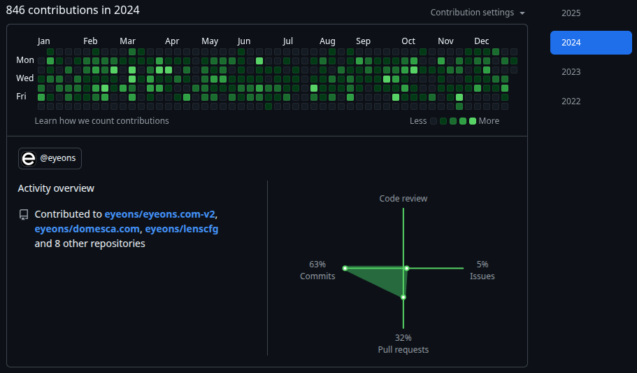
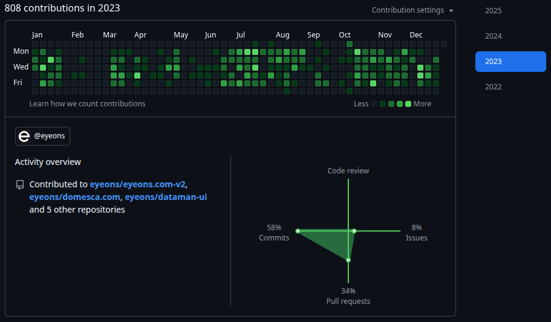
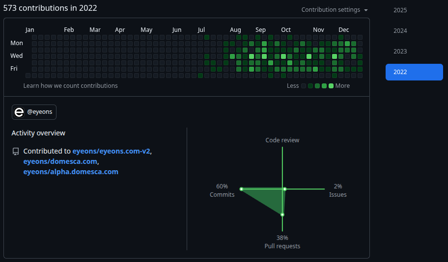

---

<!-- Badges -->

---

## 👋 About Me

Hi, I'm **Daryna**—a passionate developer who loves building things with code.

- 🔭 I’m currently working on [Users Management Interface](https://github.com/daryna-kh/usersManagement)
- 🌱 I’m learning advanced TypeScript patterns
- 💬 Ask me about JavaScript and frontend performance

---

## 🛠 Skills

### Languages

  
  
  
  
  
  
  
  

### Frameworks & Tools

  
  
  
  
  
  
  
  
  
  
  

### Softwares

  
  
  
  
  
  
  
  
  
  
  
  
  

---

## 📊 Activity & Stats

### Contributions Calendar

- **2025**
  

    
  

- **2024**
  

    
  

- **2023**
  

    
  

- **2022**

  

    
  

### Top Languages

## 📫 Contact & Socials

  <a href="mailto:darinabkh98@gmail.com">✉️ Email</a> •
  <a href="https://www.linkedin.com/in/rinabkh/">🔗 LinkedIn</a> •

---

_Thanks for visiting! ✨_
